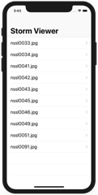
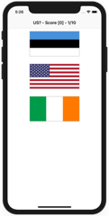
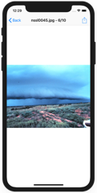
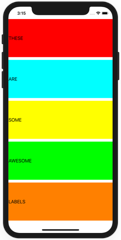
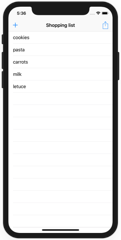
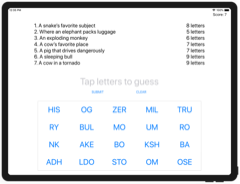
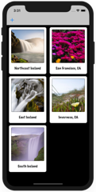

# Preview of some Apps

## Preview

Projects / Topics                                                                                                                                                            | Screenshots
---                                                                                                                                                                          |---
[Project1](Project1) - *Storm Viewer*                                        View controllers, Storyboard, FileManager                                |   |
[Project2](Project2) - *Guess the Flag*                                          UIButton, CALayer, IBAction                                              |  |
[Project3](Project3) - *Social Media*                    UIBarButtonItem, UIActivityController                                    |  |
[ProjectPro1](ProjectPro1) - *Country Flags*                                                                                                            |   |
[Project4](Project4) - *Easy Browser*                                          WKWebView, Action sheets, UIToolbar, UIProgressView                      |   |
[Project5](Project5) - *Word Scramble*                                        Reading from disk, UIAlertController, IndexPath                          |  |
[Project6](Project6) - *Auto Layout*                                       Auto Layout, Constraints, Visual Format Language                         |   |
[ProjectPro2](ProjectPro2) - *Shopping List*                                                                                                            |  |
[Project7](Project7) - *Whitehouse Petitions*                                          UITabBarController, JSON, Data, Codable                                  |   |
[Project8](Project8) - *7 Swifty Words*                                          UI in code, Text alignment, Layout Margins, UIFont                       |  |
[Project9](Project9) - *Grand Central Dispatch*                                          Grand Central Dispatch, PerformSelector                                  |   |
[ProjectPro3](ProjectPro3) - *Hangman*                                                                                                           |     |
[Project10](Project10) - *Names to faces*                             UICollectionView, UIImagePickerController, NSObject                      |  |
[Project11](Project11) - *Pachinko*                                        SpriteKit, Nodes, UITouch, Physics Body, SKAction, Collisions, Emitters  |   |
[Project12](Project12) - *User Defaults*                                   UserDefaults, JSON, NSCoding, Codable                                             |  |
[ProjectPro4](ProjectPro4) - *Photo captions*                                                                                                        |   |
[Project13](Project13) - *Instafilter*                                       UISlider, UIImagePickerController, CIContext, CIFilter, Saving photos    |   |
[Project14](Project14) - *Whack-a-Penguin*                                        SKCropNode, SKTexture, SKAction                                          | 
[Project15](Project15) - *Animation*                                                           Animation, CGAffineTransform                                             |  |
[ProjectPro5](ProjectPro5) - *Country facts*                                                                                                        |   |
[Project16](Project16) - *Capital Cities*  (with challenges)                                         MapKit, MKMapView, MKAnnotation, CLLocationCoordinate2D                   |    |
[Project17](Project17) - *Space Race*  (with challenges)                                         Collisions, Timer, Linear / Angular damping                              |   |
[Project18](Project18) - *Debugging*                                                           Debugging                                                                | No screenshot |
[ProjectPro6](ProjectPro6) - *Shooting Gallery*                                                                                                        |    |
[Project19](Project19) - *Javascript Injection*  (with challenges)                                         Safari Extensions, NSExtensionItem, UITextView, NotificationCenter       |    |
[Project20](Project20) - *Fireworks Night*  (with challenges)                                         UIBezierPath, SKAction follow, Emitter nodes                           |    |
[Project21](Project21) - *Local Notifications*  (with challenges)                                 Notifications, UNUserNotificationCenter, UNNotificationRequest           |    |
[ProjectPro7](ProjectPro7) - *Notes*                                                                                                        |      |
[Project22](Project22) - *Detect-a-Beacon*  (with challenges)                                         iBeacons, Core Location, CLBeaconRegion                                  |     |
[Project23](Project23) - *Swifty Ninja*  (with challenges)                                         SKShapeNode, AVAudioPlayer, CGPath, UIBezierPath, SKTexture              |    |
[Project24](Project24) - *Swift Strings*  (with challenges)                                         Strings, NSAttributedString                                              | No screenshot |
[ProjectPro8](ProjectPro8) - *Swift Extensions*                                                                                                        | No screenshot |
[Project25](Project25) - *Selfie Share*  (with challenges)                                         Peer to Peer networking, MCSession, MCBrowserViewController, MCPeerID    |      |
[Project26](Project26) - *Marble Maze*  (with challenges)                                         Accelerometer, CMMotionManager, Load level from file, Physics Bitmasks   |     |
[Project27](Project27) - *Core Graphics*  (with challenges)                                 Core Graphics, UIGraphicsImageRenderer, Fills and Strokes, Transforms    |   |
[ProjectPro9](ProjectPro9) - *Meme Generator*                                                                                                       |    |
[Core Graphics redux](37-CoreGraphics-Redux)                                                                                                                  | No screenshot |
[Project28](38-Project28) - *Secret Swift*  (with challenges)                                 Biometrics authentication, Touch ID, Face ID, iOS keychain               |     |
[Project29](39-Project29) - *Exploding Monkeys*  (with challenges)                                         SKTexture, Filling a path, Mixing UIKit and SpriteKit, Texture atlases   |     |

